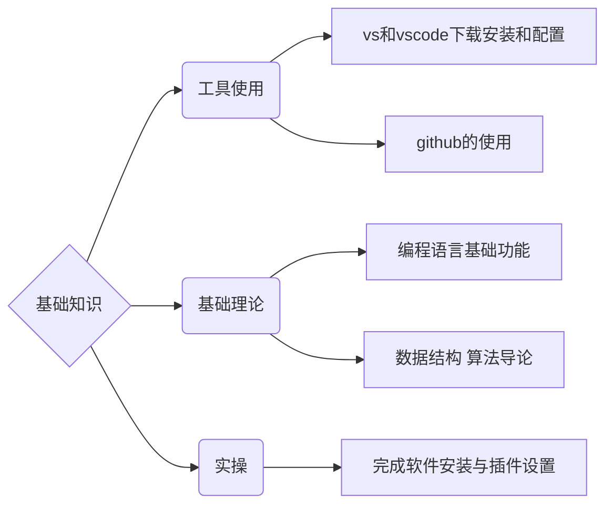
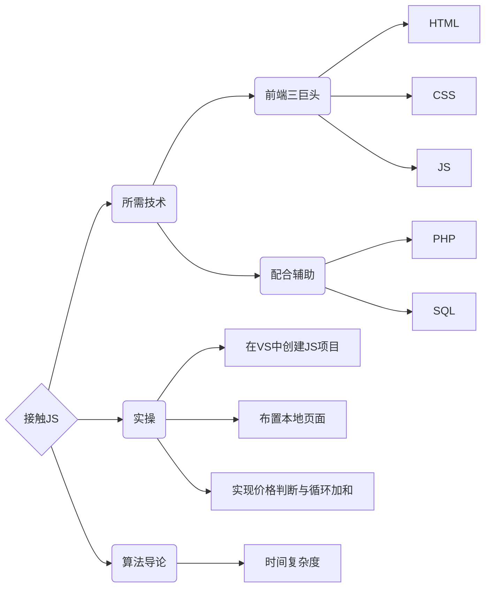

# 
脏脏的编程课

 

零基础的编程入门教学课程

献给我心爱的脏脏

祝她永远健康快乐

希望我们都能持续地进步

活成我们各自想要样子

 

 

## 
教学大纲

 

每节课包含三部分：代码语法、实操、算法导论&数据结构知识

教学指导文档在每节课的文件夹中

课程中的所有流程图需使用 [github-mermaid-extension](https://github.com/BackMarket/github-mermaid-extension) 插件后方能显示

如果图片无法加载，则需要翻墙

安装方法：

-  **Google Chrome**: [GitHub + Mermaid - Chrome Web Store](https://chrome.google.com/webstore/detail/github-%20-mermaid/goiiopgdnkogdbjmncgedmgpoajilohe)
-  **Firefox**: [GitHub + Mermaid - Firefox Add-ons](https://addons.mozilla.org/en-GB/firefox/addon/github-mermaid/)

 

## 
目录

 

### 一、基础知识

#### [进入课程文档](https://github.com/AngleOldPig/ZangZang-s-Coding-Course/blob/master/1.%20%E5%9F%BA%E7%A1%80%E7%9F%A5%E8%AF%86/基础知识.md)

 

 

### 二、接触JS

#### [进入课程文档](https://github.com/AngleOldPig/ZangZang-s-Coding-Course/blob/master/2.%20%E6%8E%A5%E8%A7%A6JS/%E6%8E%A5%E8%A7%A6JS.md)

 

 

 
