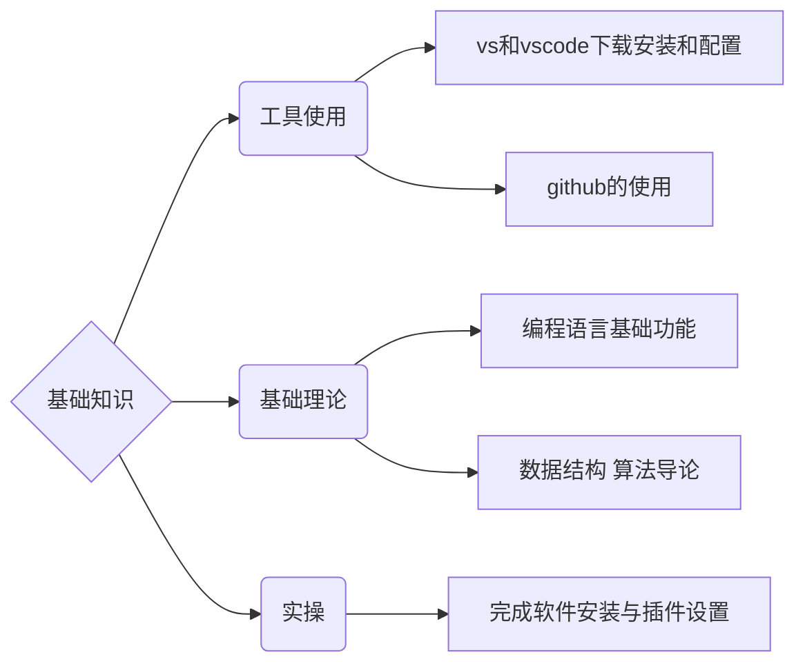

# 脏脏的编程课

 

零基础的编程入门教学课程

献给我心爱的脏脏

祝她永远健康快乐

希望我们都能持续地进步

活成我们各自想要样子

 

 

## 教学大纲

 

每节课包含三部分：代码语法、实操、算法导论&数据结构知识

教学指导文档在每节课的文件夹中

课程中的所有流程图需使用 [github-mermaid-extension](https://github.com/BackMarket/github-mermaid-extension) 插件后方能显示

安装方法：

- .svg) **Google Chrome**: [GitHub + Mermaid - Chrome Web Store](https://chrome.google.com/webstore/detail/github-%20-mermaid/goiiopgdnkogdbjmncgedmgpoajilohe)
-  **Firefox**: [GitHub + Mermaid - Firefox Add-ons](https://addons.mozilla.org/en-GB/firefox/addon/github-mermaid/)

 

### 一、基础知识

 

 

### 二、接触js

 

    1.前端三巨头：html、css、js

       配合辅助：php、SQL

    2.实操：创建本地页面，实现价格判断与循环加和

    3.算法导论：时间复杂度O()